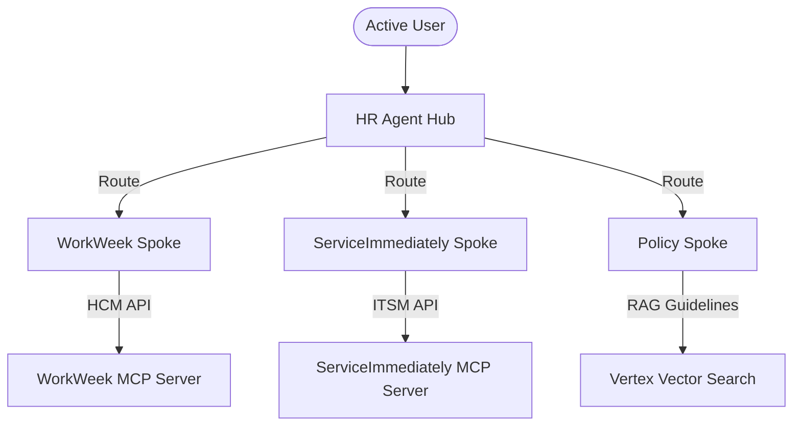

# Tier 1 HR Chatbot Agentic Solution (MVP 1)

This repository contains the production-ready agentic solution for a Tier 1 HR Assistant. The solution leverages a **Hub-and-Spoke architecture** using the Google Agent Development Kit (ADK) to integrate with multiple enterprise systems securely.

---

## 1. System Architecture

The chatbot is structured as a hierarchical agent group to ensure strict tool isolation, modular prompts, and high accuracy:



### Modular Spoke Agents
1.  **WorkWeek Spoke**: Manages employee profiles, leave balances, contact details updates, and time-off requests.
2.  **ServiceImmediately Spoke**: Handles incident ticket lifecycles,Facilities badging requests, and adding comments/transitions.
3.  **Policy Spoke**: Queries local vector database documents to answer corporate policy guidelines.

---

## 2. Security & Governance Guardrails

The application executes strict input and output guardrail checks to protect employee privacy and corporate compliance:
*   **Role-Based Access Control (RBAC)**: Validates requester identity against a manager mapping utility to allow lookup of direct reports, while strictly blocking unauthorized lookups of third-party profiles with an `AccessDeniedException`.
*   **SPII Redaction**: Dynamically sanitizes output payloads for potential Single Personal Identifying Information leakage.
*   **Toxicity Filtration**: Automatically blocks any response flagged as unsafe or toxic.
*   **Retrieval Grounding**: Cross-verifies model answers against execution tool outputs to eliminate hallucinations.

---

## 3. Local Installation & Execution

### Prerequisites
*   Python 3.11+
*   `uv` package manager installed (`pip install uv`)

### Setup Configuration
Create a `.env` file at the root:
```env
GEMINI_MODEL=gemini-2.5-flash
RETRIEVAL_MODE=mock
X_MCP_TOKEN=your_mcp_token_here
WORKWEEK_MCP_URL=https://mock-saas.aishprabhat.demo.altostrat.com/work-week/mcp/
SERVICEIMMEDIATELY_MCP_URL=https://mock-saas.aishprabhat.demo.altostrat.com/service-immediately/mcp/
```

### Running the App & Chatbot UI
```bash
# Install dependencies
uv sync

# Run the UI server
uv run python ui/app.py
```
Open your browser at [http://localhost:8000](http://localhost:8000) to chat with the agent.

---

## 4. Quality & Compliance Evaluation

Compliance tests are structured under the `tests/eval/` directory matching the official `agents-cli` format.

### Run Compliance Evaluation Benchmarks
```bash
# Set credentials
export GEMINI_API_KEY="your-api-key"

# Run single-turn benchmarks
agents-cli eval run \
  --config tests/eval/eval_config.yaml \
  --dataset tests/eval/datasets/eval-data.json

# Run multi-turn workflows
agents-cli eval run \
  --config tests/eval/eval_config.yaml \
  --dataset tests/eval/datasets/eval-multi-turn.json
```
For more information about custom scoring metrics and dataset coverage, check the [Evaluation Report](agents/HR%20agent/tests/eval/evaluation_report.md).
